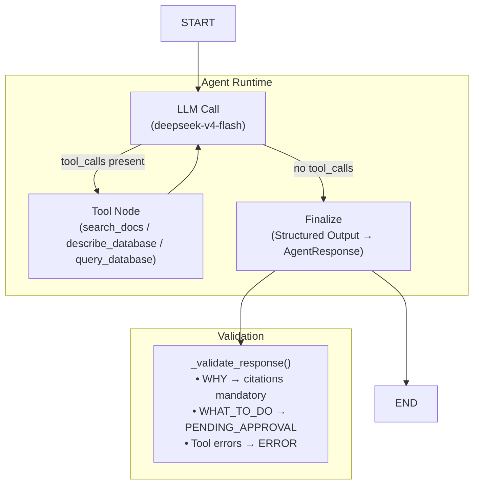
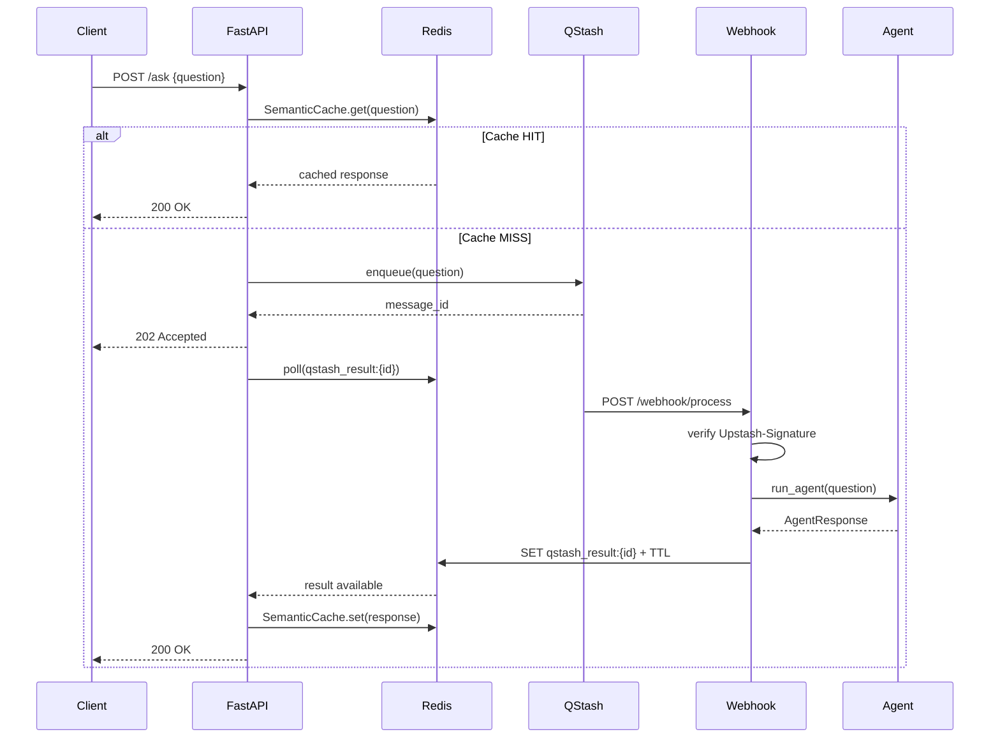

# Approach

## Problem Summary

Create an assistant that answers **What / Why / What-to-do** questions over structured sales data (8 CSV tables, 52 weeks, 5 product categories, 12 territories) and unstructured text documents (30 email/note files). The system must handle data quality issues, support causal analysis with citations, and defer recommendations for human approval.

Three core question types:
- **WHAT** — factual queries (e.g., "What were GlucoJoy's monthly primary sales vs target in North in Nov 2025?")
- **WHY** — causal analysis with mandatory citations (e.g., "Why did SparkClean 1kg spike in Mumbai in Sep 2025?")
- **WHAT_TO_DO** — recommendations returned with `PENDING_APPROVAL` status

---

## Technical Approach

### 0. Data Cleaning

| Issue | Table | Rows Affected | Fix |
|---|---|---|---|
| Multiple date formats (4) | fact_primary_sales | 10,972 | Normalized to `YYYY-MM-DD` |
| Non-numeric sales value (`"Rs 1,234"`) | fact_primary_sales | 9,416 | Extracted numeric portion |
| 9999 sentinel in units | fact_primary_sales | 771 | → NULL, flag = `sentinel_9999` |
| Negative values in units | fact_primary_sales | 734 | → NULL, flag = `negative` |
| -9999 sentinel in units | fact_primary_sales | 1 | → NULL, flag = `sentinel_-9999` |
| Duplicate rows (23 pairs) | fact_primary_sales | 23 omitted | Keep first, rest→`omitted/` |
| Territory `BLR`/`BGL`/`Bombay` | 4 tables | ~190 | Mapped to `Bengaluru`/`Mumbai` |
| Distributor ID leading `0` | fact_primary_sales | 24 IDs | Stripped `lstrip("0")` |
| SKU tier abbreviations | dim_sku | 8→3 values | Lowercased, `val`→`value`, `prem`→`premium` |
| Region abbreviations | dim_geo | 2 values | `S`→`South`, `E`→`East` |
| `territory == "North"` (region) | promotions | 1 omitted | Moved to `omitted/` |
| Missing rep_name | dim_rep | 1 | Filled from `rep_id` |

### 1. Data Modelling

Star schema: 4 dimension tables (`dim_geo`, `dim_sku`, `dim_rep`, `dim_distributor`) + 2 fact tables (`fact_primary_sales`, `fact_targets`) + 2 supporting tables (`promotions`, `stockouts`). Relationships enforced via foreign keys.

```mermaid
erDiagram
    dim_geo ||--o{ dim_rep : ""
    dim_geo ||--o{ dim_distributor : ""
    dim_geo ||--o{ fact_primary_sales : ""
    dim_geo ||--o{ fact_targets : ""
    dim_geo ||--o{ promotions : ""
    dim_geo ||--o{ stockouts : ""
    dim_sku ||--o{ fact_primary_sales : ""
    dim_sku ||--o{ fact_targets : ""
    dim_sku ||--o{ promotions : ""
    dim_sku ||--o{ stockouts : ""
    dim_distributor ||--o{ fact_primary_sales : ""

    dim_geo {
        string territory PK
        string region
    }
    dim_sku {
        string sku_code PK
        string category
        string brand
        string sku_name
        string pack_size
        string flavour
        string tier
        string base_mrp
    }
    dim_rep {
        string rep_id PK
        string rep_name
        string territory FK
    }
    dim_distributor {
        string distributor_id PK
        string distributor_name
        string territory FK
    }
    fact_primary_sales {
        date week_start PK
        string sku_code PK FK
        string territory PK FK
        string distributor_id PK FK
        int primary_sales_units "nullable"
        float primary_sales_value
        string sales_units_flag
    }
    fact_targets {
        date month PK
        string material_no PK FK
        string area PK FK
        float target_value
    }
    promotions {
        date week_start PK
        string sku PK FK
        string territory PK FK
        string promo_type
        float promo_discount_pct
    }
    stockouts {
        date week_start PK
        string item_code PK FK
        string territory PK FK
        string stockout_flag
        int stockout_days
    }
```

### 2. Sentinel & Negative Handling

Sentinel values (9999, -9999) and negative values in `primary_sales_units` are **nulled** rather than removed. Each nulled row carries a `sales_units_flag` column (`sentinel_9999`, `sentinel_-9999`, `negative`, or `ok`) so the agent can identify unreliable data points and adjust confidence in its conclusions. The system prompt explicitly instructs the agent to use this flag.

### 3. Text Data Cleaning

All 30 `.txt` documents processed through a PII redaction pipeline:
- **Phones**: `+91XXXXXXXXXX` → `<REDACTED_PHONE>` (4 redactions)
- **Emails**: `name@domain.com` → `<REDACTED_EMAIL>` (4 redactions)
- **Names**: `From:` header + action-verb context → `<REDACTED_NAME>` (4 redactions)
- **Chunking**: 1 chunk per document (documents are short notes/emails, no semantic splitting needed)
- **Metadata extraction**: category, ref, tags, attributes, redaction counts

### 4. Retrieval & Tools

Three tools mounted to the agent:

| Tool | Purpose | Data Source |
|---|---|---|
| `search_docs` | Semantic search over unstructured docs | ChromaDB (Gemini embeddings, 1536d) |
| `describe_database` | Schema discovery for the LLM | SQLAlchemy ORM introspection |
| `query_database` | SQL-like query builder with filters, joins, aggregation, pagination | SQLite/PostgreSQL via ORM |

### 5. Agent Architecture

Single-agent tool loop (LangGraph `StateGraph`):



- **Timeout**: 180s, enforced via `ThreadPoolExecutor`
- **Multi-agent avoided**: single agent with tool loop reduces complexity, latency, and token waste vs. multi-agent supervision
- **Structured output**: two-pass — LLM gathers data via free-form tool calls, then a second invocation reformats into validated `AgentResponse` JSON

### 6. Message Queue (QStash)



### 7. Semantic Caching

- **Embedding model**: `gemini-embedding-2` (1536d)
- **Similarity threshold**: 0.97 (cosine)
- **Storage**: Redis hashes with TTL (600s default)
- **Cache promotion**: hit refreshes TTL (hot-cache)
- **Limitation**: Current TTL-based invalidation is naive. Better approach: invalidate on data update events + pre-synthesize cache for frequent topics

### 8. Tracing

Langfuse integrated at module load in `graph.py`. Traces every LLM call, chain step, and tool invocation. Falls back silently if unconfigured.

---

## AI Tool Usage

- **Primary agent**: OpenCode (Cadra) with `ctxMode` extension for context management
- **Strengths**: Long-running multi-step tasks when specified with step-by-step breakdowns; efficient documentation lookup when source is explicitly mentioned
- **Weaknesses**: Doesn't auto-detect `ctxMode`; misses LSP warnings unless explicitly flagged; used deprecated LangGraph APIs; returned 200 on timeouts
- **Prompt history**: Attached in `working_prompts/`

---

## Trade-offs & Limitations

1. **Single vs. multi-agent**: Chose single agent with tool loop. Multi-agent would introduce supervision overhead, state management complexity, excessive token consumption, and higher latency without clear benefit for this scope.
2. **Data inconsistencies**: Many sales number anomalies lack documentation. Better source context could salvage some data points with more nuanced handling.
3. **Cache invalidation**: Current TTL-only approach is naive. Production version should invalidate on data update events and pre-synthesize responses for frequent topics.
4. **Model choice**: `deepseek-v4-flash` is overkill and slower than needed. Used due to resource constraints on `gemini-flash-lite`.
5. **Query ORM wrapper**: Current query builder limits complex SQL. A read replica with raw query execution would enable larger, more complex queries in a single call.
6. **Evals**: No systematic prompt benchmarking or evaluation suite.
7. **Tracing**: Langfuse integration broken in Vercel deployment — would debug given time.
8. **QStash migration**: Reworked from `python-rq` to QStash mid-development, burning AI credits and preventing dedicated review loops.